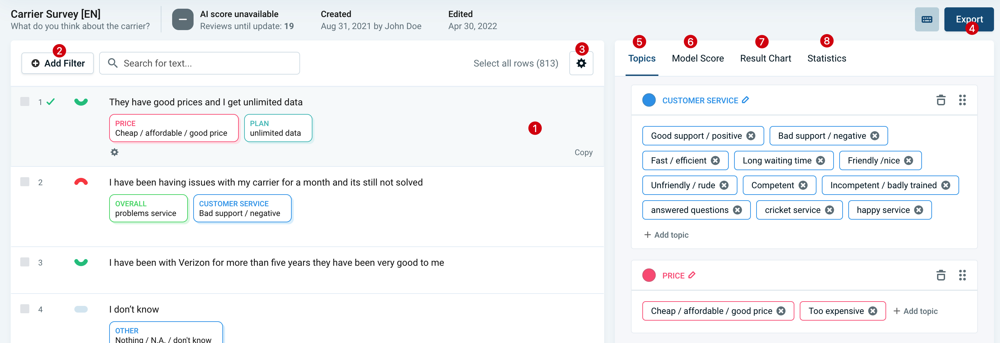

# Fine-tuning View

As the name suggests, this view lets you fine-tune the AI towards your specific needs, by reviewing a small portion of your data. The view also allows **modifying topics, filtering and exporting the data**.

## Overview

1. [Rows](#rows)
2. [Filters](#filters)
3. [View Options](#view-options)
4. [Export](#export)
5. [Topic Editor](#topic-editor)
6. [AI Score](#ai-score)
7. [Result Chart](#result-chart)
8. [Statistics](#statistics)

## Rows

Here the text to analyze is displayed, alongside the assigned topics.

### 1. Text

If translations have been activated for this project and set to be shown in the [view options](#view-options) (enabled by default, if project is translated), the translated text is shown here. To toggle to the source language version, click the *See original* button (element 9 in screenshot above).

See also **TODO: Translations**

### 2. Assigned Topics

Here you see which topics have been assigned to the row. In this example we have the topics:
* `Rates` with a positive sentiment, belonging to the category `PRICING`
* `Unlimited Date` without sentiment, belonging to the category `PLAN`

Topics are auto-assigned by the AI (see [this article](03-02-AI-assignments.md) on how AI updates work) or can be manually changed by clicking on the row.

### 3. Other Columns

Other columns of your project can be displayed alongside the text. Click the cogwheel icon or open the [view options](#view-options) to choose which columns to display.

### 4. Overall Sentiment

The overall sentiment of the text can be either *positive, neutral or negative*.

It is computed automatically and cannot be adjusted manually. However, when sentiment-entabled topics are assigned to the text, the overall sentiment is adapted accordingly.

### 5. Reviewed State

The checkbox indicates this row has been set as reviewed. Reviewed rows are not modified by the AI anymore but are used as training data for the AI when fine-tuning. When analyzing, visualizing or exporting the data, it is not relevant if a row has been reviewed or not.

### 6. Row Number

This is the index of the row in the project you uploaded / imported into Caplena.

### 7. Bulk Select Checkbox

To edit the topics of multiple rows at once, click this checkbox or hold shift and select multiple rows. See also [here](03-03-Changing-topic-assignments.md#bulk-assignment).

### 8. Duplicates

If this icon is shown, it means the text of this row is exactly the same as one or more other rows. The number besides the icon indicates how many exact duplicates are present in the project. The duplicates are based on the translated text, if translations are enabled.

By default, duplicates are assigned the same topics and are also marked as *reviewed*, when you review one of them. To disable this behaviour, adjust the duplicates grouping setting in the [view options](#view-options).

<!-- theme: info -->
> Duplicate grouping may be *temporarily disabled* if specific filters are applied (e.g. when filtering for other columns in your data), to prevent confusing behaviour. A notification is shown on the top right whenever this is the case.

### 9. See Original Text

If translations are enabled, you can toggle between the translated text and the original one with this button. To define which text should be shown for all rows, open the [view options](#view-options).

See also translations. [TODO]

## Filters

Add filters to only show a subset of all rows. Filters are also applied to exports triggered from this view, see [this article](03-04-Export.md)].

## View Options

The view options allow you to specify a couple of settings which define the appearance of your data:
* **Display additional columns:** Which additional data columns from your project to show below the text. See also [Other Columns](#other-columns).
* **Group identical responses:** If enabled (default), duplicate texts are only shown once. [Learn more](#duplicates).
* **Show Translations:** If enabled, the translations are shown instead of the original text. This is the default, if translations were enabled for the project when importing the data. See also [TODO].

## Export

See [Export](03-05-Export.md).

## Topic Editor

In the topic editor you can edit exiting topics, merge them or add new ones. Click on a topic to edit it or drag it onto another one to see the merge options. To learn more about how topics work, see also [Topics.](02-01-Topics.md)

<!-- theme: info -->
> Whenever topics are changed or added this triggers an AI update. See also [AI Topic Assigmnents](02-01-Topics.md).

## AI Score

See [AI Score](03-02-AI-assignments.md#ai-score).

## Result Chart

Get a live overview of the current distribution of topics. [TODO Screenshot]

## Statistics

See some stats on your project.
