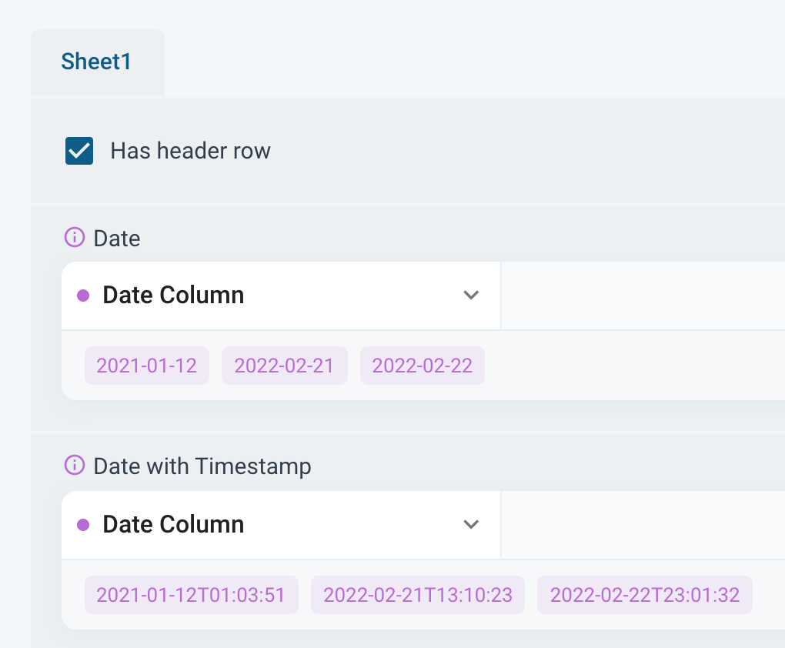

# Creating New Project

* [Upload a File](#upload-file)
* [Direct Input](#direct-input)
* [Integrations](#integrations)
* [Projects with multiple Text Columns](#multiple-text-columns)
* [Leverage and visualize Non-Text-Data](#leverage-non-text-data)
* [Date Support](#date-support)

## Data Import
Importing data into the Caplena platform is the first step to start a new project. After clicking on the *New Project* or *Import Data* button you will be able to choose between three data import options.

### Upload a File
Using this option, you can simply drag and drop your data file into the import box or browse to the location of your file. The currently supported data formats for this import option are: .xls, .xlsx, .csv, .txt, .spss and .sav.

#### Data Structure
The data should be arranged in columns and rows, where the rows include the indiviudal records such as respondends, reviews or social media feedback.

The first row of the data file will be treated as the column header or title. In case you have the description of your data columns across several rows, e.g., the variable name in the first row and a description the second, you should delete one of these rows or merge them into a single row.

#### Organize your data

Once you've uploaded your file, you'll be taken to a screen where you can organize your data. Here’s a quick guide on what you’ll see and how to manage your columns:

**Left Side: Your Data Columns**

- Column Names: All the columns from your file will be listed on the left. Each name corresponds to the header in your data file.
- Data Preview: Below each column name, you can preview the first 5 records from your data.

**Right Side: Column Types**
- Column Types: On the right, you'll see the types of columns present in your file.
- Interactive Selection: Feel free to click around and explore.
- When you select an open-text column, you'll see all the columns the system detected for analysis. You can toggle these columns on or off depending on your project needs.

You can analyze up to 25 open-ended columns in a single project. Toggle the columns on or off based on what you need for your analysis.

**Summary Section**
- A summary will show the number of rows and columns imported.
- Below this, you’ll see the number of credits charged. Credits are our internal currency, and we charge one credit for each row of text in your file.

Once you've finished, click on "Continue to Settings" to configure project settings.

Here, you can:

- Assign a name to your project.
- Add tags for easy project sorting in the future.
- Set the language for your topic collection.
Below, you'll find advanced settings:

- Enable translations if you wish to translate your verbatims into another language.
- Enable anonymization to remove personal identifiable information (PII) from all text comments.

### Direct Input
You can also enter or copy your data directly into the upload window. The lines will be separated by pressing enter. When copying the data directly from Excel or a similar application, the data will be line-separated automatically.

### Integrations
The third and last option to import data to analyse with Caplena is the direct integration of external data sources, which are mainly customer reviews from various customer review websites, such as Amazon, Trustpilot, Google Maps etc.

Here you can select reviews for one or several products, services, locations (shops, restaurants, hotels, etc.) or software applications by copying the URL or a similar unique identifier to start with the data import.

Currently available sources for customer reviews / integrations are as follows:

For each external data source you will find a guideline on how to identify the reviews that you would like to analyze. In most cases it is as simple as copying the URL, just click on any of the logos in your [Upload](https://caplena.com/app/upload) section and follow the steps behind it.

Please also have a look at our more detailed article on our integrations feature: [Integrations in Detail](docs/04-09-Integrations-in-Detail.md)

The following tutorials show the Integrations features in practice:
- A case study comparing two meditation apps - [Click here](https://blog.caplena.com/2021/08/25/headspace-vs-calm-a-comparative-analysis-of-customer-reviews/)
- Tutorial walk-through taking the Netflix app as an example - [Click here](https://blog.caplena.com/2020/05/06/walk-through-analyzing-open-ended-feedback-a-3-step-video-tutorial-on-netflix-app-reviews/)

## Multiple Text Columns
When starting a project, you have either a single column with text to analyze or you have several text columns in one row. The latter is often true when analyzing survey data with several open-ended questions.

### A Single Column
In case you are analyzing the answers to a single open-ended question from a survey, reviews from a customer review website (such as Google Maps, Apple App Store, Amazon, etc.) or social media feedback, you will have a project with a single text-column. Thus, you simply upload your open-ended data together with your auxiliary data columns (these can be any additional variables such as ID, ratings, demographics, dates, countries, etc.) that you like to use for analysis, filtering, and segmentation.

### Multiple Columns
When analyzing survey data, you might have more than one open-ended question in your questionnaire. In such cases, you do not have to create several individual projects to analyze them across different individual projects. Instead, you can import your data all at once as a single file.

The example below includes two open-ended questions as well as several auxiliary variables for analytical purposes.

Using this approach makes only sense when you have your data organized like in the example above, i.e., in one sheet in which each row represents one respondent.

Despite having all questions within one project, the actual analysis will take place on an individual text level. All text columns / questions will be shown when accessing your project.

### Merging Columns

In situations where you need to analyze text across several data cells (e.g., when several columns relate to the same answer), we recommend merging those answers in your data file before uploading them to Caplena.

Follow these steps:

- **Use Excel Function for Merging:** Utilize the Excel function =CONCATENATE(A2;B2), which merges the content of two cells into one.

- **Include a Dividing Character:** To distinguish content sources, include a dividing character. For example, use =CONCATENATE(A2;" || ";B2), where the two pipe symbols (||) act as indicators for content origin.

- **Add All Columns to Merge:** Ensure you add all the cells you'd like to merge using the concatenate function.

By consolidating information before uploading it to Caplena, you'll streamline the analysis process, making it more effective across all your fully open projects.

## Leverage Additonal Columns / Non-Text Data
When uploading a project to Caplena, all columns you do not select to be processed as text, will be treated as additional columns and uploaded to the platform nevertheless.

This data could be metadata of the respondent (age, gender, customer segment, country, etc.), an ID column for later identification in the export file, or responses to closed-questions such as a likelihood to recommend question (NPS score).

Non-Text data will be displayed and can be used at different stages of the analysis process, e.g., to be shown together with the text data during fine-tuning, in the row browser when reading the text behind specific topics and of course for your charts and dashboards to segment and filter the results.

<!-- theme: info -->

> To benefit most from Caplena, we recommend adding as many relevant additional columns as possible.

### View Options

Once you click on a text in the [*Fine-Tuning View*](06-01-Fine-tuning-view.md) you will see your uploaded non-text data on the right.

You can also use the little cog wheel at the top right of the text display and select any of these variables to be shown underneath the text.

### Filters

You will find filters in the Fine-Tuning View, on Charts and Dashboards. You will find your imported non-text data under "Additional Columns" and they can be used to filter text or results.

The "Standard Fields" at the top of the filter menu are filters that are based on the coding, i.e., allowing you to filter by categories, text, review status etc. These will always be available, even though you did not import any additional variables together with your text data.

### Segments

Additionally uploaded data can be used to create segments to analyze specific types of respondents based on the variables available. In the example below, the results are shown by smart phone brand.

The example above **shows the usage of the "standard segments" available in the "Chart setup"** which include the segmentation by sentiment, numerical and categorial values and the NPS score.

In the **main menu, "Chart settings", you can create and build any individual segment with the help of filters**. Individual segments can be edited and duplicated in any which way.

## Date Support

Including date columns in your uploads enables you to use Caplena for trend analysis and date filtering. 

### Date Import

If you're using our integrations for online reviews or survey collection tools you don't need to worry about date detection so you can skip this section as it is automatically imported and detected. If you're uploading files you need to make sure that the date format is accepted. In order to be  recognized as date column, your values need to match one of the following formats:

- YYYY-MM-DD, i.e. "2022-01-30" (aka ISO Format)
- DD.MM.YYYY, i.e. "1.30.2022" or "01.03.2022"
- DD/MM/YYYY, i.e. "1/30/2022" or "01/30/2022"

**Other formats may be supported**, check the sample data in the "Organize" step to verify that it was recognized correctly:

During import, all values of date columns will be normalized to ISO Format (YYYY-MM-DD) no matter which source format the values had. Timestamps will be parsed as well if available as can be seen in the second column in above screenshot.

Note that american-style dates like **MM/DD/YYYY are not supported**, convert to day-first before upload.

 

