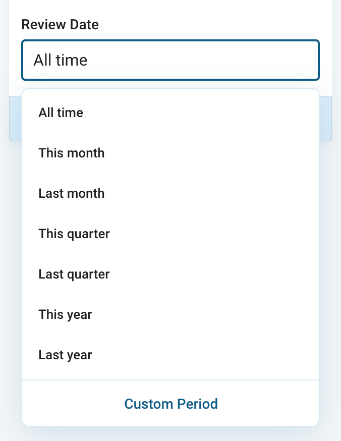
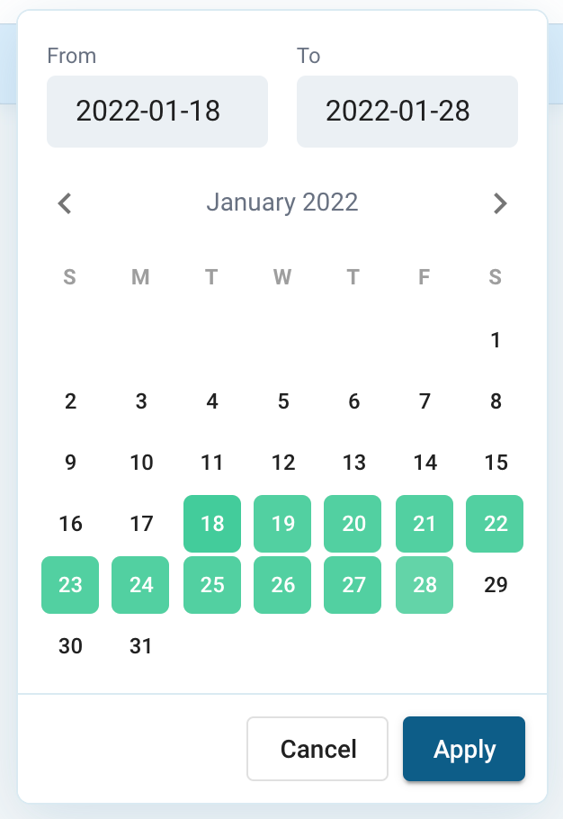

# Data Import

* [Three Data Import Options](#import-options)
* [Projects with multiple Text Columns](#multiple-text-columns)
* [Add more Text Data to an existing Project](#add-more-text-data)
* [Leverage and visualize Non-Text-Data](#leverage-non-text-data)
* [Date Support](#date-support)

## Import Options
Importing data into the Caplena platform is the first step to start a new project. After clicking on the *New Project* or *Import Data* button you will be able to choose between three data import options.

### Upload a File
Using this option, you can simply drag and drop your data file into the import box or browse to the location of your file. The currently supported data formats for this import option are: .xls, .xlsx, .csv, .txt, .spss and .sav.

#### Data Structure
The data should be arranged in columns and rows, where the rows include the indiviudal records such as respondends, reviews or social media feedback.

The first row of the data file will be treated as the column header or title. In case you have the description of your data columns across several rows, e.g., the variable name in the first row and a description the second, you should delete one of these rows or merge them into a single row.

#### Additional Data
Together with your text to analyze you can upload additional data columns with text and / or numerical data, such as age, gender, NPS-scores etc. These additional data columns will not be analyzed as text and you will not be charged for them. However, we recommend uploading additional data columns as you can use them as segmentation or filter variable and they can also be display besides your text when fine-tuning.

### Direct Input
You can also enter or copy your data directly into the upload window. The lines will be separated by pressing enter. When copying the data directly from Excel or a similar application, the data will be line-separated automatically.

### Integrations
The third and last option to import data to analyse with Caplena is the direct integration of external data sources, which are mainly customer reviews from various customer review websites, such as Amazon, Trustpilot, Google Maps etc.

Here you can select reviews for one or several products, services, locations (shops, restaurants, hotels, etc.) or software applications by copying the URL or a similar unique identifier to start with the data import.

Currently available sources for customer reviews / integrations are as follows:

For each external data source you will find a guideline on how to identify the reviews that you would like to analyze. In most cases it is as simple as copying the URL, just click on any of the logos in your [Upload](https://caplena.com/app/upload) section and follow the steps behind it.

Please also have a look at our more detailed article on our integrations feature: [Integrations in Detail](docs/04-09-Integrations-in-Detail.md)

The following tutorials show the Integrations features in practice:
- A case study comparing two meditation apps - [Click here](https://blog.caplena.com/2021/08/25/headspace-vs-calm-a-comparative-analysis-of-customer-reviews/)
- Tutorial walk-through taking the Netflix app as an example - [Click here](https://blog.caplena.com/2020/05/06/walk-through-analyzing-open-ended-feedback-a-3-step-video-tutorial-on-netflix-app-reviews/)

## Multiple Text Columns
When starting a project, you have either a single column with text to analyze or you have several text columns in one row. The latter is often true when analyzing survey data with several open-ended questions.

### A Single Column
In case you are analyzing the answers to a single open-ended question from a survey, reviews from a customer review website (such as Google Maps, Apple App Store, Amazon, etc.) or social media feedback, you will have a project with a single text-column. Thus, you simply upload your open-ended data together with your auxiliary data columns (these can be any additional variables such as ID, ratings, demographics, dates, countries, etc.) that you like to use for analysis, filtering, and segmentation.

### Multiple Columns
When analyzing survey data, you might have more than one open-ended question in your questionnaire. In such cases, you do not have to create several individual projects to analyze them across different individual projects. Instead, you can import your data all at once as a single file.

The example below includes two open-ended questions as well as several auxiliary variables for analytical purposes.

Using this approach makes only sense when you have your data organized like in the example above, i.e., in one sheet in which each row represents one respondent.

Despite having all questions within one project, the actual analysis will take place on an individual text level. All text columns / questions will be shown when accessing your project.

## Add More Text-Data

You may have already started or finished the analysis for your project, but you would like to add more data, be it from a new or previous wave or from an additional market and the like.

You can add new data to your project any time by using the *Upload further answers* feature that you will find at the top menu when selecting your project from the [Project View](https://caplena.com/app/projects).

Provided your existing data has already been analyzed, i.e., topic collection was applied, the newly added data will be automatically assigned with topics based on the existing topic collection.

This procedure can be repeated as many times as you wish.

### Data Structure

The additional data should be arranged in the same way as the original data, i.e., it should have the **same number of data columns** and they should be **arranged in the same order**. The data rows can be in any order.

### Auto-Translation

In case you would like to use our auto-translation feature, please **enable it when you initially create your project**. It is not possible to enable this feature retrospectively when uploading additional data to an existing project with no auto-translation enabled. Learn more about [auto translation](09-01-Languages.md#auto-translation-in-detail).

### Duplicate Row Handling

A row of data is considered to be a duplicate if all values in all columns are exactly equal. By default, duplicates will be ignored and not be imported. However, in case you would like to disable this feature, you can simply turn of the *Skip existing* function in the *Match your data* view (see screen shot below).

**De-duplicate rows by ID-number**: Optionally, and as an alternative to the above, you can choose a column with unique values only (such as an ID-number) to identify already existing rows. If no ID column is selected, rows are identified following the rules described in the previous paragraph.

## Add or Replace Additional Columns
Sometimes, during project work, you may find the need to

* add additional data columns
* update existing data within the additional columns
* delete additional columns imported initially

This can be achieved using the **add or replace additional columns** feature which is part of the *Project Actions* (the icon showing a pair of scissors), the menu at the top right when opening any project from the *Project List*.

<!-- theme: info -->

> Note: This feature concerns any additional column, i.e., the columns that can be used as filter and for segmentations. Text columns will not be affected!

**In short the feature / process works as follows.**

1. Make your changes offline in the original data file
2. Select the “Add or replace” feature from the *Project Actions*
3. Drop your file
4. Check and confirm changes in the *Match Columns* view

The individual steps in detail.

### Data File Preparation
Use the data file you used for your initial import and make the required changes in that same file, i.e., delete columns, add columns, or make changes to any of the additional columns.

Make sure that the data is in the same order as it is on the platform. If in doubt or in case you have already added several waves of data, you can always export the file from the platform and make the changes in that file. This ensures you have all the data in one file and the records are in the same order as in Caplena.

**Follow these steps when using a file exported from Caplena.**

* Delete all coding information and metadata (such as review status, text highlight information, etc.) as well as the two nested rows at the top that indicate the column sections.
* Also remove the text to analyze column, the text columns will not be effected.

The file in which you will do your changes should only contain the additional columns in the order of initial import.

Apply your changes to this file.

<!-- theme: warning -->
> #### Check numerical columns when exporting Excel files
>
> When exporting data in Excel format it can happen that epmpty cells in numerical columns are filled with a place holder such as #NUM or #ZAHL. Please check and replace with an empty value before the re-import. This can be avoided when exporting the data in CSV format.

### File Import
Navigate to your *Project List* and open the project which you would like to change. Select **add or replace** from the *Project Actions* and drop the file with the changes. 

After dropping the file the *Match Columns* screen will allow you to review your changes before being applied. The Summary at the bottom right will show the number of
* Columns present previously  and in new file
* Columns not present anymore in new file
* New columns

Move your mouse overt the information icon next to each of the three items and the column names will be shown.

When the proposed changes match your expectation click on **Replace & Save**, the blue button on the bottom right. Your data file will be imported, and the changes will be applied. You will be able to see and use the changed set of additional columns as filter and for segmentation.

## Leverage Additonal Columns / Non-Text Data
When uploading a project to Caplena, all columns you do not select to be processed as text, will be treated as additional columns and uploaded to the platform nevertheless.

This data could be metadata of the respondent (age, gender, customer segment, country, etc.), an ID column for later identification in the export file, or responses to closed-questions such as a likelihood to recommend question (NPS score).

Non-Text data will be displayed and can be used at different stages of the analysis process, e.g., to be shown together with the text data during fine-tuning, in the row browser when reading the text behind specific topics and of course for your charts and dashboards to segment and filter the results.

<!-- theme: info -->

> To benefit most from Caplena, we recommend adding as many relevant additional columns as possible.

### View Options

Once you click on a text in the [*Fine-Tuning View*](06-01-Fine-tuning-view.md) you will see your uploaded non-text data on the right.

You can also use the little cog wheel at the top right of the text display and select any of these variables to be shown underneath the text.

### Filters

You will find filters in the Fine-Tuning View, on Charts and Dashboards. You will find your imported non-text data under "Additional Columns" and they can be used to filter text or results.

The "Standard Fields" at the top of the filter menu are filters that are based on the coding, i.e., allowing you to filter by categories, text, review status etc. These will always be available, even though you did not import any additional variables together with your text data.

### Segments

Additionally uploaded data can be used to create segments to analyze specific types of respondents based on the variables available. In the example below, the results are shown by smart phone brand.

The example above **shows the usage of the "standard segments" available in the "Chart setup"** which include the segmentation by sentiment, numerical and categorial values and the NPS score.

In the **main menu, "Chart settings", you can create and build any individual segment with the help of filters**. Individual segments can be edited and duplicated in any which way.

## Date Support

Including date columns in your uploads enables you to use Caplena for trend analysis and date filtering. 

### Date Import

If you're using our integrations for online reviews or survey collection tools you don't need to worry about date detection so you can skip this section as it is automatically imported and detected. If you're uploading files you need to make sure that the date format is accepted. In order to be  recognized as date column, your values need to match one of the following formats:

- YYYY-MM-DD, i.e. "2022-01-30" (aka ISO Format)
- DD.MM.YYYY, i.e. "1.30.2022" or "01.03.2022"
- DD/MM/YYYY, i.e. "1/30/2022" or "01/30/2022"

**Other formats may be supported**, check the sample data in the "Organize" step to verify that it was recognized correctly:

During import, all values of date columns will be normalized to ISO Format (YYYY-MM-DD) no matter which source format the values had. Timestamps will be parsed as well if available as can be seen in the second column in above screenshot.

Note that american-style dates like **MM/DD/YYYY are not supported**, convert to day-first before upload.

### Date Charts

If a date column is present in your data, you can use special date charts to visualize trends in your data. Charts that operate on date are identifiable by a small calendar icon. Currently only the Date Line & Pie chart supports date. Use the radio buttons in the Chart Setup to switch between different aggregation levels (i.e. Years or Months).

### Filtering in charts and dashboards

Two kinds of filters are available for charts and dashboards that behave fundamentally differently:

 
#### Dynamic date ranges

Selecting one of the dynamic date ranges like "This month" will filter for date values of the current month when viewing the chart. If the filter is saved with the chart then opening the same chart a month later will show different data as the current month has changed. The same applies to the rest of the options in the list:

#### Fixed date ranges ("Custom Period")

For these filters, you select a specific date range from a calendar (i.e. 1st of January 2022 until 12th of February 2022). If you store the chart with the filter applied, the filtered date range will always remain the same.

