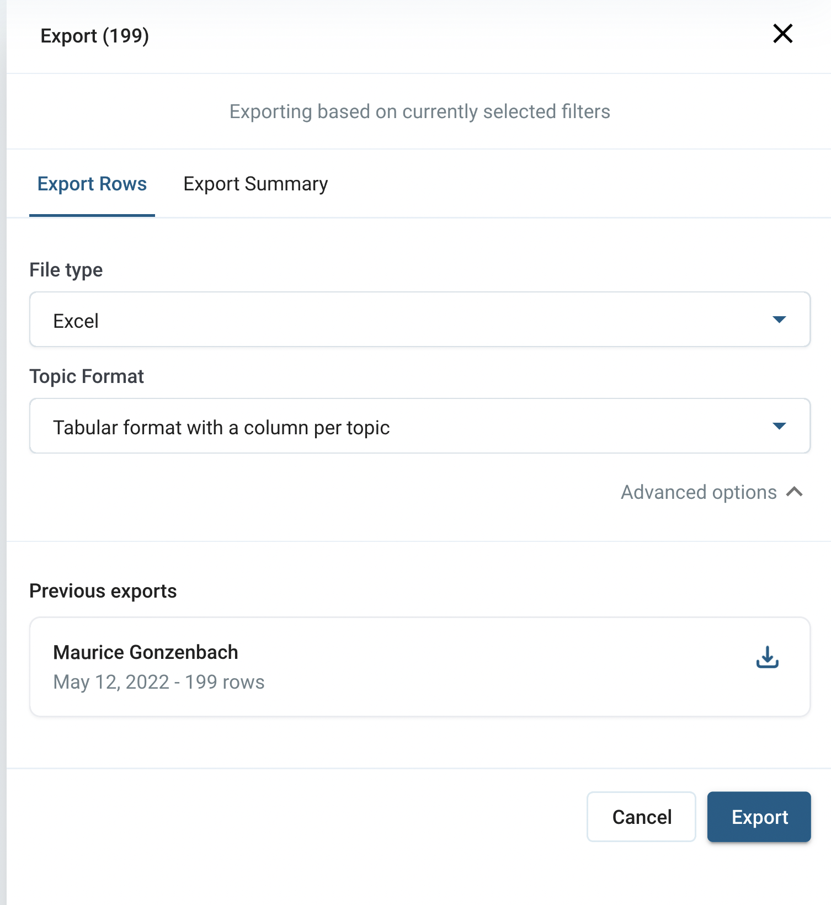

---
stoplight-id: befab1a9dd1a7
---

# Export

To download your data, hit the *export* button on the top right of the page.

When exporting from the [fine-tuning view](06-01-Fine-tuning-view.md), the generated export will respect the [filters](06-01-Fine-tuning-view.md#filters) that you have applied - only the rows matching the current filters will be exported. To export all rows, simply clear any applied fields.

There are two options for exporting your data:

1. [Export Rows](#1-export-rows)
2. [Export Summary](#2-export-summary)

<!-- theme: info -->

> For very large projects with tens to hundreds of thousands of rows it might take a couple of minutes to prepare the export.

## 1. Export Rows

In this mode *all* rows will be exported, containing both the *text to analyze column* that you are currently viewing, as well as any additional (non-text to analyze) columns.

*This export mode is well suited if you want to further process the data on a row-level or store the per-row topics in your own systems.*

## 2. Export Summary

The summary shows the number of occurrences and frequency for each category, topic, and topic sentiment version.

*Use this export mode if you want to visualize the overall results in another application.*

## Previous Exports

For both export modes, previous downloads are available for download during [TODO] days after having been created.