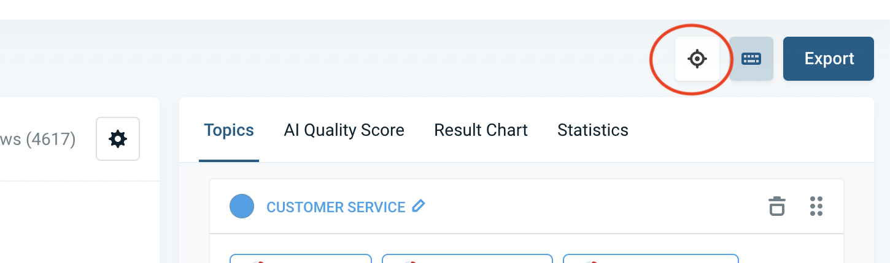
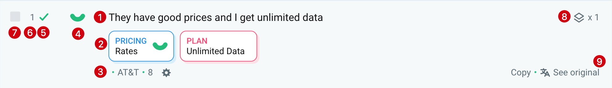
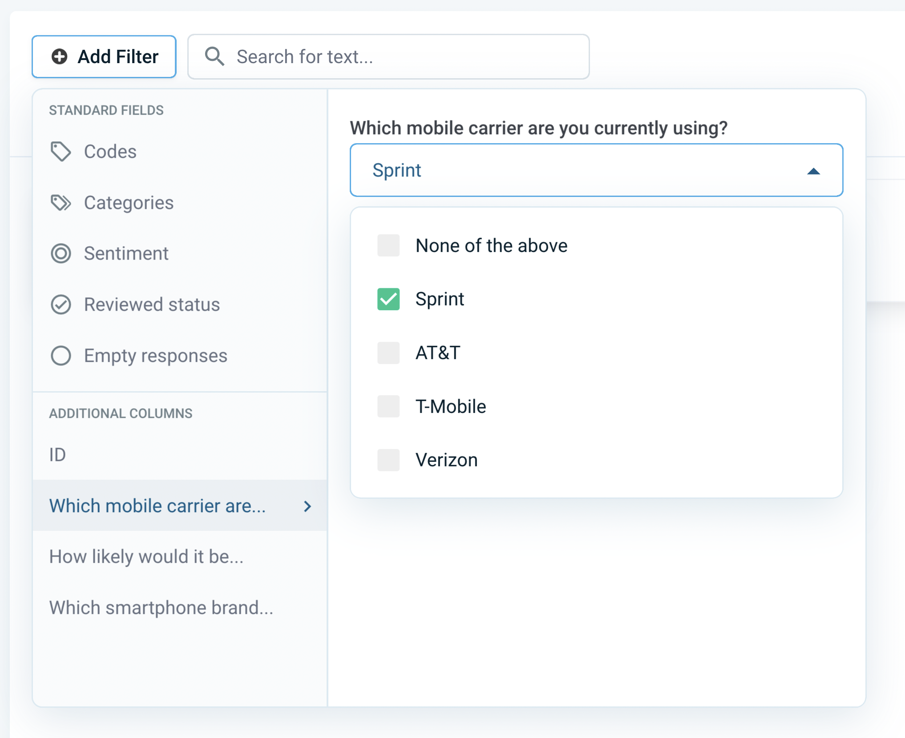

# Fine-Tuning 

* [Fine-Tuning View](#fine-tuning)
* [Reviewing a Row](#reviewing-a-row)
* [Focus Mode](#focus-mode)


The Topic Assignment view is designed to adjust the AI to better meet your specific needs.


 By reviewing a small portion of your data, you can refine how the AI interprets and categorizes information. This view also allows you to:

- Modify topics as needed
- Apply filters to focus on specific data segments
- Export the data for further analysis or reporting

Below, you’ll find some information on how to perform reviews.

### Reviwing a Row (Fine-Tuning)
The purpose of fine-tuning is to guide the AI in the right direction by providing it with additional training data. This is done through a process called **reviewing**, where you either confirm the AI's topic assignments or adjust them to better align with your expectations for a few rows. Below, you'll find a video that demonstrates how the process works.

https://youtu.be/OyQjsKhHZAs

<!-- theme: success -->

> The recommended way to go about this is by using the **Focus Mode 🤓**. Alternatively you can also click on a specific row you want to edit, which will open the sidebar.

### Focus Mode

Activate the focus mode by clicking the icon on the top right of the fine-tuning view.



This mode does a couple of things:
* The rows are **sorted** by **AI certainty**: This means that you will first be shown the texts where the AI is *most unsure* on its assignments. By reviewing and potentially correcting these assignments first, the AI learns much more efficiently.<br>This technique is also known as *active learning*.
* Only non-reviewed rows will be shown, as you do not want to look at already reviewed rows again.
* Any potential distractions are hidden, so you can fully focus on the content of the text.


<!-- theme: info -->

> The AI automatically updates the topics assignment every now and then in the background after you have made enough reviews or made changes to the topics. See [this article](#when-is-the-ai-updated) to learn when exactly updates are performed.


## Topic Assignment User Interface

Please watch this quick walkthrough of the Topic Assignment View: https://www.loom.com/share/c5d42ccac2884111803d7c4946af4465?sid=a0720402-78ed-48e7-bc58-2e248a92e608

You can also find the information about the Topic Assignment View below:


### Rows

Here the text to analyze is displayed, alongside the assigned topics.



#### 1. Text

If translations have been activated for this project and set to be shown in the [view options](#view-options) (enabled by default, if project is translated), the translated text is shown here. To toggle to the source language version, click the *See original* button: 


See [here](09-01-Languages.md) for more information on how translations work.

#### 2. Assigned Topics

Here you see which topics have been assigned to the row.


 In this example we have the topics:
* `Price` with positive sentiment, belonging to the category `PRICE`
* `Overall quality` with positive sentiment, belonging to the category `QUALITY`

Topics are auto-assigned by the AI (see [this article](06-02-AI-assignments.md) on how AI updates work) or can be manually changed by clicking on the row.

#### 3. Other Columns

Other columns of your project can be displayed alongside the text. Click the cogwheel icon to choose which columns to display.


#### 4. Overall Sentiment

The overall sentiment of the text can be either *positive, neutral or negative*.


It is computed automatically and cannot be adjusted manually. However, when sentiment-enabled topics are assigned to the text, the overall sentiment is adapted accordingly.

Given at least one sentiment-enabled topic is present, the formula for the sentiment is:

```
sentiment_sum = sum_over_topics(1 if topic is positive | 0 if topic is neutral | -1 if topic is negative)
sentiment_average = sentiment_sum / number_of_topics
if (sentiment_average > 0.33) return 'positive'
if (sentiment_average < -0.33) return 'negative'
else return 'neutral'
```

#### 5. Reviewed State

The checkbox indicates this row has been set as reviewed. Reviewed rows are not modified by the AI anymore but are used as training data for the AI when fine-tuning. When analyzing, visualizing or exporting the data, it is not relevant if a row has been reviewed or not.


#### 6. Row Number

This is the index of the row in the project you uploaded / imported into Caplena.


#### 7. Bulk Select Checkbox

To edit the topics of multiple rows at once, click this checkbox or hold shift and select multiple rows. See also [here](#bulk-assignment). To select all rows that match a certain condition, filter for those rows first and then click the Select all rows link on the top right of the row browser.


#### 8. Duplicates

If this icon is shown, it means the text of this row is identical to one or more other rows. The number besides the icon indicates how many exact duplicates are present in the project. The duplicates are based on the translated text if translations are enabled.


By default, duplicates are assigned the same topics and are also marked as *reviewed*, when you review one of them. To disable this behavior, adjust the duplicates grouping setting in the [view options](#view-options).

<!-- theme: info -->
> Duplicate grouping may be *temporarily disabled* if specific filters are applied (e.g. when filtering for other columns in your data), to prevent confusing behavior. A notification is shown on the top right whenever this is the case.

<!-- theme: info -->
> To ensure identical rows are grouped together in your analysis, make sure that all rows have the same status (e.g., all rows should be either reviewed or unreviewed) and have the same topic assigned. 

#### 9. See Original Text

If translations are enabled, you can toggle between the translated text and the original one with this button. To define which text should be shown for all rows, open the [view options](#view-options).

See [here](09-01-Languages.md) for more information on how translations work.

### Filters

Add filters to only show a subset of all rows. Filters are also applied to exports triggered from this view, see [this article](04-07-Export.md).



### View Options

The view options allow you to specify a couple of settings which define the appearance of your data:
* **Display additional columns:** Which additional data columns from your project to show below the text. See also [Other Columns](#3-other-columns).
* **Group identical responses:** If enabled (default), duplicate texts are only shown once. [Learn more](#8-duplicates).
* **Show Translations:** If enabled, the translations are shown instead of the original text. This is the default if translations were enabled for the project when importing the data. See also [here](09-01-Languages.md).


### Export

See [Export](04-08-Export.md).


### Topic Editor

In the topic editor you can
* edit topic properties, *by clicking on them*
* merge or combine them to sentiment topics, *by dragging them onto each other*
* add new topics or categories

https://youtu.be/j3quiv6lTqE

To learn more about how topics work, see also [Topics.](03-01-Topics.md)

<!-- theme: info -->
> Whenever topics are changed or added, this triggers an AI update. See also [AI Topic Assignments](#when-is-the-ai-updated).

### AI Score

See [AI Score](#ai-score).

### Result Chart

Get a live overview of the current distribution of topics.


### Statistics & Number of Rows

See some core statistics of this column / project.

<!-- theme: info -->
> A common question is why the number of rows stated in the statistics **doesn't match the number** shown in the bottom left of the row browser or the top right *Select all rows* link.
> 
> The reason for these potential discrepancies are [duplicates](#8-duplicates), which are *hidden* by default in the row browser (thus resulting in a lower number of rows) but *are* counted in the `Statistics` section. Grouping of duplicates can be disabled in the [view options](#view-options).


```

