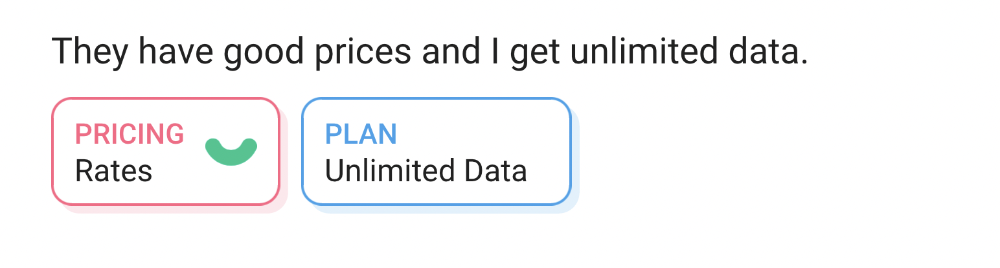

# AI Topic Assignments

Caplena's AI automatically assigns the appropriate topics from your topic-tree to your texts 🪄.

* [How the AI works](#how-the-ai-works)
* [Fine-Tuning](#fine-tuning)

## How the AI works

### Understanding of Topics

The AI does *not* work like a keyword matching algorithm. Instead, it attempts to *understand* the topics. This means you don't have to add any synonyms, it already knows that `Overpriced` and `Too expensive` mean the same thing.
See [topic properties](03-01-Topics.md#topic-properties) to understand which topic properties are relevant for the AI.

For sentiment-enabled topics, only *one sentiment version* is assigned at the time, i.e. a row cannot have the `positive` and `negative` version of a topic at the same time.

### Model Architecture

This is of course part of our secret sauce and nothing we can share publicly 🙊. What we can say is that we make use of a heavily modified Transformer architecture. For the technically interested, check out [this article](https://jalammar.github.io/illustrated-transformer/) on transformers.

Technically speaking, the AI performs a multilabel classification, meaning that zero, one or multiple topics can be assigned to the same row.

### AI Training

Our AI is trained in a three-step process:

1. **Pretraining:** First we pretrain it on a massive amount of unstructured data, basically a dump of the internet. From this the AI learns a basic language understanding including things like synonyms, antonyms, and negations.
2. **Training on Caplena's data:** The second, crucial step is to train it on the millions of rows of hand-reviewed data that we have on Caplena.
3. ***(Optional)* Fine-tuning:** Finally, you can fine-tune the AI on a small amount of your specific data, to nudge it into the right direction.

## Fine-Tuning

To fine-tune the AI on your specific data, simply review a sample of your data. Reviewing means going over the rows and either confirming the AI's assignments or changing them to meet your preference. See [this article](06-01-Fine-tuning-view.md#fine-tuning) on how this works in detail.
