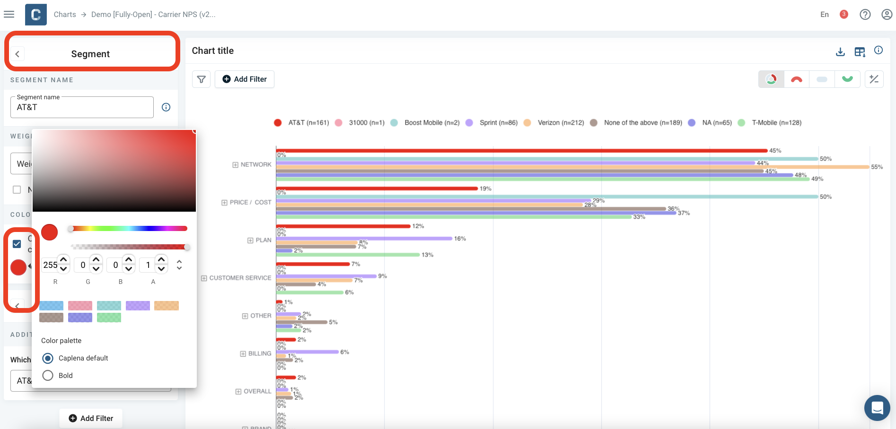

# Charting with Caplena

In the cockpit view of any of your projects the data will be visualized by default in form of a chart. However, you can create, edit, and save your individual set of charts based on our chart library. You can download the individual charts, or you can use them to create dashboards to turn your data into a story and share them among your colleagues and clients.

## Creating a New Chart

You can create charts from the cockpit view of any of your projects. The chart menu is on the right where you will see your chart collection once they have been created.

By clicking on the "New Chart" button you will be taken to the charting view, where you can choose the appropriate chart type, customize its layout, and filter your data.

By default, the data will be shown as bar chart. Other chart types can be selected from the menu on the left. Currently there are **eight different chart types available for the coded data and two chart types for visualizing and analyzing scores**, such as NPS, customer satisfaction or other averages.

## Charts Available

With the following set of charts, you can visualize your coded results and begin telling your story. 

- Bar chart
- Line & pie chart
- Treemap
- Relationship graph 
- Sentiment bar chart
- Comparison bar chart

All these charts are **interactive**, which means you can **click on the topics and categories and you will see the data behind it**, i.e., the text on which the analysis is based.

All **charts are connected to the data**, meaning they are **always based on the latest coding status**. In case you make any changes to your data, all related charts will be instantly updated.

### The Working Horse

This is a highly flexible chart type that can be used for a single question or different questions combined. With this chart you can show total results as well as comparisons between sub-sets or different segments.

The following example from a NPS survey shows the coded results broken into the three NPS segments, i.e., comparing the answers between Detractors, Passives and Promoters.

### Show and Monitor Trends

The main use case for this chart is to show how your data changes over time. This could be a great choice when comparing different survey waves or in the case of continuously collected data from customer feedback systems or when collecting customer reviews from websites such as Amazon, Google Maps, Apple Store etc. using our [Integrations feature](04-09-Integrations-in-Detail.md).

The following chart shows an example of reviews of TV set brends. In this case, the results are shown on a monthly basis.

### Hierachical Distribution

The treemap provides an intuitive overview of the distribution of each category and its individual codes.

### Relationship Graph

With the relationship graph you can innovatively analyze and visualize which codes have a strong relationship, i.e., which codes occur frequently together with the feedback of the customers.

## Visualizing Scores

With the following two chart types you can include and visualize your numerical data, most commonly scores, such as NPS, CSAT or similar types of averages.

### Score Chart

The score chart shows the average score and the distribution of the values. In the example below, the NPS is shown with the distribution across the three NPS groups, i.e., Promoters, Passives and Detractors. Of course, this can be applied to any other score such as CSAT scores or the average star ratings when using our [Integrations feature](04-09-Integrations-in-Detail.md).

### Driver Analysis

Using driver analysis you can measure a **topic’s impact on customer satisfaction**, whether it is on the NPS, CSAT or your custom build customer satisfaction or loyalty score.

Our **in-build driver analysis is based on a multiple regression analysis** for measuring the relative impact of each individual category or topic on a score (NPS, CSAT, star rating, etc.). The **relative impact of the topic on that score is shown on the x-axis**, meaning that the further on the right a topic occurs on the scatter chart the higher is its impact on the score. The **y-axis shows the frequency of how often a topic was mentioned**.

Any **topic that appears in the upper right of scatter chart has a high positive impact** on the customer satisfaction score and matters to many (mentioned by many) - these aspects can be considered key strengths. **Topics occurring on the upper left also matter to many, but have a negative impact** on the score, thus can be considered key weaknesses. This chart can be a very effective tool to determine your future actions, i.e., ensure that you maintain your strengths and improve where your product or service is currently considered weak.

For further reading about our driver analysis follow the link to one of our recent blog posts: [Chart of the Month: Driver Chart](https://caplena.com/blog/what-is-a-driver-chart/).

## Using Additional Columns as Segments

Any additional variable can be used to slice and dice your data based on specific criteria, such as demographics, location, or other relevant factors. Additional variables can be found under any “Add Filter” button under “Additional Columns”, when looking at:

- **Topic Assignment**
- **Charts**
- **Dashboards**

<!-- theme: info -->
>Example Scenario:
>Suppose you want to analyze customer feedback by age, you can use the "Age" column as an additional variable to filter or segment and compare responses by different age brackets.

## Creating Charts with Segments

Charts can be created from the Cockpit of any of your projects or via the main menu (top left next to the Caplena logo under “Charts”). When entering the charting you are in the Chart Setup, where you can choose the chart type on the top left. To compare segments in a single chart select the Bar Chart.

To compare segments in a bar chart you have two options.

- **Option 1:** Use the “auto-segmentation” for a one click comparison by additional column.
- **Option 2:** Create individual segments tailored to your needs. As the auto-segmentation is limited to a maximum of 15 different values for categorical variables, this is your choice in case you want to compare segments from an additional column which includes more than 15 attributes. Such columns would not being displayed as a choice in the auto-segmentation.

### Option 1: Auto-Segmentation

When you select the bar chart from the chart library on the left, you will see the “Segment By” menu at the bottom left. Here you can click on any of the options and created segmented charts by
- **Sentiment** to break the results by positive, negative, and neutral.
- **Numerical columns** where all your numerical columns will be available to choose from. The system will create the number of segments selected. No worries, the segments can be adapted, please see below how to do it.
- **Categorical column** for a break for any column with labeled attributes.
- **NPS column** to break the data by the three NPS groups (Promoters, Passives, and Detractors), just make sure the column with the likelihood to recommend was selected.

<!-- theme: info -->
>Segments can be edited!
>To edit a segment, click at the little arrow next to “Chart Setup” at the top left, which will bring you to the “Chart Settings”. At the bottom left you will see your segments.

.png>)

To make any change to any of these segments you can click on the edit symbol at the right to the segment's name.
 Once in the segment, you can change the segment's name (as it will be shown in the legend) as well as the segment's properties, which in most cases will be one filter that you can open and amend your selection. 
 You can also click on “Add Filter” at the bottom right, to a segment built across various additional columns. Here you can also change the colors of your segments by “overwriting” the automatic selection.

.png>)

### Option 2: Manual Creation of Segments

You can build the segments into a bar chart from scratch, the option to choose when your additional column exceeds the limit of 15 attribute value choices or when you want to use a column type going beyond the auto-segment choices, such as time period based on a date variable.

When you select the bar chart you click on the little arrow next to the “Chart Setup” at the top right and you will arrive at the “Chart Settings”. As you did not select a segmentation, you will see one segment which is the total segment across all data of the project.

.png>)

Next to the name of the segment, which is per default the project name, you see an edit icon as well as a duplicate icon. When clicking on edit, you will be able to change segment name, color, as well as the filter options. With the latter you will create your segment. Just click on “Add Filter” at the bottom left and select the additional column you want to use to build your segment.

.png>)

Once the filter is selected, you change the name of the segment. Let’s say you chose “Age” as an additional column and your first segment is the group between 18 and 25 years. You select the group within the filter and change the name to your liking. Once this first segment was created, you click on the duplicate icon next to edit on your first segment and a copy of the first segment will be made. Now you click on the edit icon of the copy, change name and filter and continue until all the segments are created.

.png>)

In case the colors are not different, just click on Colors in the chart menu on the left and select “Segment” instead of Category or Topic.

.png>) 

## Advanced - Segments Multiple Projects

Assuming you have two or several projects from the same or a very similar project, you can compare the results across these projects as segments or create an aggregate number across all these projects.
<!-- theme: info -->
>Please note! To show the results across different studies, only topics are shown that are identical, not only by label, but also by numerical code!

When you select the bar chart you click on the little arrow next to the “Chart Setup” at the top right and you will arrive at the “Chart Settings”. As you did not select a segmentation, you will see one segment which is the total segment across all data of the project. Underneath this total segment for this project, you can click on “‘Add Segment”, which will open your project list from which you can select the other project.

.png>)

Per default, the results of the two projects will be shown as two different segments.

.png>)

In case, you would like to see the total results across both projects, select “General” from the main menu and then tick the “Aggregate segments” option and your results will be shown in total across all projects selected.

.png>)

There is another chart type allowing you to compare a single column value against the total average, please have a look here for the A/B Chart.

## Changing Chart Colors

You have the flexibility to change chart colors at various stages of the app. 

The most effective way is to align the chart colors with the color of the topics for a consistent representation of each category. Simply go to Chart Settings and select Colors from the menu to modify the color of topics:

Within the topic assignment, you can change the color for a category by clicking on the colored dot next to its name. You have the option to select from the color palette or use RGB codes for a personalized palette:

For charts like the bar chart with segments, or those displaying scores or topic sentiment, you can customize colors for individual elements. Edit the segment and overwrite the color, or navigate to the color menu in other chart types to make the desired changes:

By following these steps, you can easily tailor the colors of your charts to suit your preferences and ensure a consistent visual representation across your analysis.

We also offer the option to incorporate your brand's colors into the available color schemes. However, please note that this customization may entail an additional fee depending on your subscription level. If you're interested in this option, please reach out to our support team for further assistance.

## Manage Your Chart Collection

Charts that you have created and saved can be accessed via the Cockpit of the project where the chart was created and stored or you can access any chart across all your projects form the chart list that you can reached via the Main Menu.

Your chart collection within the individual project Cockpit is on the right:

Via the *Main Menu* you can reach and mange all your charts across all your projects:

To return to the project Cockpit from the chart settings, you can simply use the back button of your browser, in case you have accessed the chart from the Cockpit. You can also simply click on the link with the project name on lower left of the menu (underneath "Segments"), which brings you right back to the project Cockpit. The latter is particularly helpful if you have accessed your chart from your main chart list or from one of your dashboards.

Otherwise, you can always go back to your project using the *Main Menu* where you select Projects to return to your project list.

## Downloading Charts
Downloading a chart to your computer is simple. You have two options:

### Download Chart as Image:
When you click the "Download Chart" icon, you can choose between two file formats either PNG or SVG, giving you the freedom to customize its size.

Feel free to adjust it to your liking! Additionally, you can add your personal touch by changing the background in the Chart Settings:

### Download the Chart Data
Alternatively, you also have the option to download an unformatted Excel file that includes both percentages and absolute numbers. This makes it a breeze to copy the data right into your charting software. This can be particularly helpful when creating a chart with segments and when you apply filters, as you will have the raw data for your specific selection.

