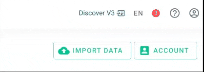

# Caplena 3.0 Beta

<!--TODO: Link video once finished-->

## Feature highlights

### Reporting

Fully rebuilt reports with support for quantitative variables, segmentation, trend detection, NPS driver simulation and advanced filtering.

### Topic Analysis

Discover new topics after the initial setup and continue to monitor upcoming themes in your tracking surveys and online reviews.

### Alerting

Configure alerts on changes or occurences of specific topics or get a regular digest with the most important developments.

### InsightChat

Dig into the data with a conversational interface, now integrated in the app. Want to pick up a past conversation? Jump back in with the new history feature.

## FAQ 🚀

Got questions about Caplena V3? We’ve got answers! 

### How do I access V3?
Switching to V3 is easy! You can seamlessly switch between the current version and V3 directly within the app at the top right.

📌 Check out how to do this:

### What will happen to my projects?
No worries—your projects will remain accessible in both versions. There’s no need to redo anything! Any fine tuning or change to the topic collection will be done on the same data and will be visible in both versions.

### What will happen to my dashboards?
Your dashboards will stay accessible for at least a year, so you’ll have plenty of time to transition. An eventual transition means the creation of a report in our completely new way of visualizing results, thus “old” charts and dashboards will not be transferred into the new version.

### Does V3 include all the final features?
Not yet! 🚧 We’re actively developing the new app, so certain features—like adding new rows to existing projects aren’t available just yet. But they’re coming soon!

### What will happen to the current live app?
The current interface will stay up and running, and we’ll continue fixing any critical issues. Once the full rollout is complete, we’ll gradually phase out parts of the old app.

### How can I share feedback?
We’d love to hear your thoughts! 💡 You can fill out the in-app survey or drop us a message at support@caplena.com. Your feedback helps us make Caplena V3 even better!
